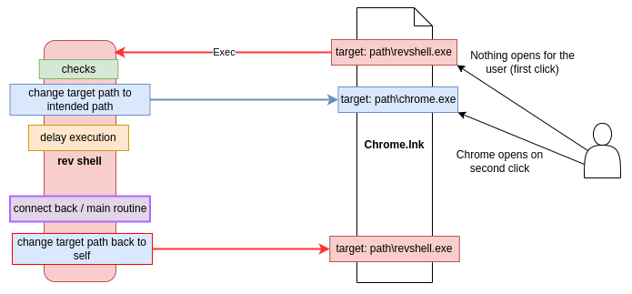

## About 
This project is my experimentation with gaining persistence on a machine through swapping target paths back and forth on already existing [LNK/shortcut](https://github.com/libyal/liblnk/blob/main/documentation/Windows%20Shortcut%20File%20(LNK)%20format.asciidoc) files. The goal here is to not mess around with the startup directories, avoid creating any new .LNKs, avoid messing with arguments, and purley rely on a user clicking on a shortcut. Currently the `modifyAllLnkPaths` and `restoreOrigLnkPaths` functions in `lnks.nim` are set to target the Desktop, TaskBar, and Start Menu shortcuts. This current implementation of this was put into a reverse shell that I put together for testing and learning. There are plenty of things that could be improved upon or expanded with it. If anyone has suggestions, let me know.

## Usage 
+ `nimble install winim checksums`
+ `nimble install https://github.com/nbaertsch/nimvoke`
+ `python compile.py`

### Reverse Shell
+ `[exit]` Exit without changing target paths
+ `[exit_persist]` Exit and set target paths back to the implant
+ `[pwsh]` Execute powershell commands through the System.Management.Automation assembly
+ `[patch]` AMSI and ETW memory patches
+ `[inject]` Spawn a remote process and inject shellcode.
+ `[start_proc]` Start a PPID spoofed process
+ `[?]` Print options

For the `inject` command: run `converter.exe sc.bin "<key>"` >> copy output >> `[LP_SHELL] > inject C:\path\to\bin.exe <b64 blob>`

### References 
+ https://github.com/nbaertsch/nimvoke/tree/main
+ https://github.com/byt3bl33d3r/OffensiveNim/tree/master/src
+ https://github.com/chvancooten/NimPlant/tree/main
+ https://github.com/libyal/liblnk/blob/main/documentation/Windows%20Shortcut%20File%20(LNK)%20format.asciidoc